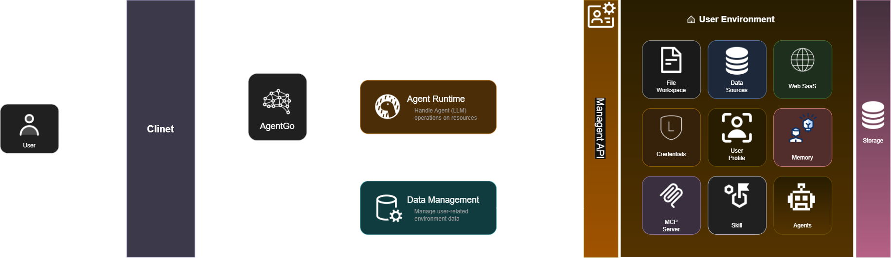
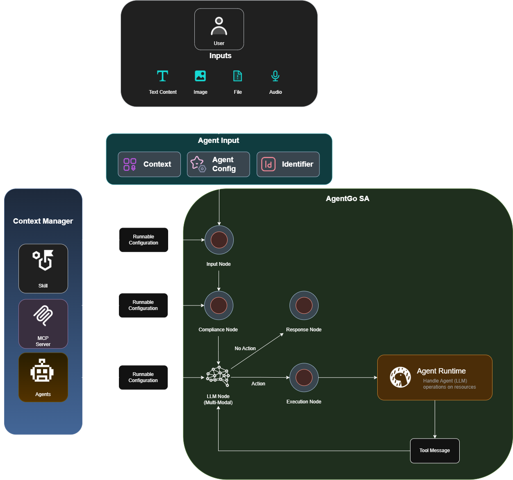

# AgentGo 系统架构



AgentGo 系统由 **客户端（Client）** 和 **后端（Backend）** 两部分组成。

- 客户端：面向用户提供系统交互界面。当前规划并实现 Web 客户端和桌面客户端，用户可通过客户端管理个人环境资源，并使用 AgentGo Agent。
- 后端：负责用户资源管理，并为智能体提供统一的运行环境。

## 一、AgentGo User Environment

在 AgentGo 中，用户可以管理归属于自身、并可按需与他人共享的环境资源。这些资源会持久化存储在数据库中，并支持可见性与访问控制管理，例如数据连接、文档、互联网检索 API、MCP Servers 和 Skills 等。资源的可用范围将直接影响 AgentGo Agent 的能力（Capability）。

AgentGo 提供统一的控制面板，用于创建、配置和管理这些环境资源。同时，AgentGo Agent 会对资源进行 **发现（Discovery）** 和 **加载（Loading）**。已发现且已加载的资源共同构成 AgentGo Agent 的 **上下文（Context）**。

下表说明架构图中 **User Environment** 所包含的环境内容。除资源本体外，系统还应保存其归属、可见范围、连接配置和授权状态等元数据，以便在运行时进行安全、可控的发现与加载。

| 环境内容   | 图中名称       | 主要用途                                                                                | 管理与运行时说明                                                                                                                 |
| ---------- | -------------- | --------------------------------------------------------------------------------------- | -------------------------------------------------------------------------------------------------------------------------------- |
| 文件工作区 | File Workspace | 为用户提供文件和目录的组织空间，用于存放任务输入、任务产物及可供 Agent 参考的本地资料。 | 用户通过客户端维护文件及目录结构。Agent 在获得授权后，可将指定文件或目录作为任务上下文进行读取、分析或写入。                     |
| 数据源     | Data Sources   | 接入结构化或非结构化业务数据，例如数据库、数据仓库、表格或知识库。                      | 系统保存数据源类型、连接配置及访问范围。Agent 通过加载后的数据源查询或分析业务数据，且应受凭据和权限控制。                       |
| Web SaaS   | Web SaaS       | 集成外部 Web 服务或 SaaS 应用，以扩展 Agent 可访问的业务系统和在线能力。                | 每个集成应维护服务地址、授权方式与可调用范围。运行时仅向 Agent 暴露已配置且授权的服务能力。                                      |
| 凭据       | Credentials    | 安全保存访问数据源、Web SaaS、MCP Server 等外部资源所需的密钥、令牌或账号信息。         | 凭据应独立于业务资源管理，并按用户、资源和权限范围进行隔离。Agent 使用凭据完成授权调用，但不应直接获取或在上下文中暴露敏感明文。 |
| 用户资料   | User Profile   | 保存用户的基础信息、偏好设置及个性化配置，为交互和任务执行提供用户维度的上下文。        | 用户可在控制面板维护个人资料。运行时按任务需要加载经过筛选的资料，以支持个性化响应，同时避免引入无关或敏感信息。                 |
| 记忆       | Memory         | 沉淀用户与 Agent 的历史交互、任务结论或长期偏好，支持跨会话的连续协作。                 | 记忆应支持分类、检索、更新和删除，并按归属与可见性管理。Agent 根据当前任务检索相关记忆，而非将全部历史记录加载到上下文中。       |
| MCP Server | MCP Server     | 通过 Model Context Protocol（MCP）接入外部工具、数据或服务。                            | 系统管理服务器地址、连接状态、工具清单和授权配置。Agent 发现并加载可用 MCP Server 后，可在受控范围内调用其提供的能力。           |
| 技能       | Skill          | 封装可复用的任务能力、操作流程或领域知识，使 Agent 能以标准方式完成特定类型的工作。     | 技能应包含名称、描述、输入输出约定和所需权限等信息。运行时根据任务与权限选择并加载合适的技能。                                   |
| Agents     | Agents         | 保存可复用的 Agent 定义，例如角色定位、模型配置、提示词、工具组合及运行策略。           | 用户可创建和管理多个 Agent。执行任务时，系统选择或由用户指定目标 Agent，并为其加载相应的环境资源与运行配置。                     |

这些环境资源由 **Data Management** 统一管理并持久化至 **Storage**；**Agent Runtime** 则通过 **Management API** 在权限范围内发现和加载资源，以支持 Agent 的执行过程。

## 二、AgentGo Agent Runtime



AgentGo Agent Runtime 将用户的多模态输入、已授权的环境资源与 Agent 配置组合为一次可执行的智能体会话。运行时的核心职责是：在受控上下文中完成理解与决策；当任务需要外部操作时，调用相应的工具或资源；再将执行结果返回模型，直至生成最终响应。

### 2.1 输入与运行配置

用户可提交文本、图片、文件和音频等输入。客户端将这些内容归一化后传递给 **Agent Input**，并补充下列运行所需的信息：

| 输入项                     | 说明                                                     | 运行时作用                                                     |
| -------------------------- | -------------------------------------------------------- | -------------------------------------------------------------- |
| 用户输入（Inputs）         | 用户提交的 Text Content、Image、File 或 Audio。          | 提供本次任务的原始意图与多模态材料，进入 Input Node 进行处理。 |
| 上下文（Context）          | 与当前用户、任务和会话相关的已授权资源及历史信息。       | 为模型提供任务背景；资源应按相关性和权限范围筛选后加载。       |
| Agent 配置（Agent Config） | Agent 的角色、模型参数、提示词、工具策略及其他运行选项。 | 决定 Agent 的行为方式、推理策略和可用能力。                    |
| 标识信息（Identifier）     | 用于关联用户、会话、任务或 Agent 实例的标识。            | 支持会话隔离、审计追踪、状态恢复及资源权限校验。               |

### 2.2 上下文管理与可运行配置

图中的 **Context Manager** 负责从用户环境中管理并提供 Skill、MCP Server 和 Agents 三类可复用能力。每类资源在被运行时使用前，都会转换为对应的 **Runnable Configuration（可运行配置）**：

| 资源类型   | 可运行配置包含的典型内容                                 | 运行时用途                                                 |
| ---------- | -------------------------------------------------------- | ---------------------------------------------------------- |
| Skill      | 技能描述、输入输出约定、调用规则及所需权限。             | 让模型识别可完成特定任务的标准化能力。                     |
| MCP Server | 服务连接信息、已发现的工具清单、调用参数约定及授权状态。 | 让 Agent 能以受控方式调用 MCP 提供的外部工具、数据和服务。 |
| Agents     | Agent 定义、角色配置、可用工具组合及协作策略。           | 为本次会话指定或扩展可执行的 Agent 能力。                  |

Context Manager 仅应生成当前任务所需、且当前用户有权使用的可运行配置。这样既避免将全部资源无差别注入上下文，也使权限控制、资源更新和运行审计保持在统一边界内。

### 2.3 AgentGo SA 执行流程

图中的 **AgentGo SA** 是单次 Agent 执行的编排区域，由多个节点按顺序协作：

1. **Input Node（输入节点）**：接收标准化后的用户输入、上下文、Agent 配置和标识信息，初始化本次任务的执行状态。
2. **Compliance Node（合规节点）**：在任务进入模型推理前，对输入、上下文和可执行配置进行规则与权限校验。未通过校验的内容不应进入后续执行链路。
3. **LLM Node（多模态模型节点）**：理解文本、图片、文件和音频等输入，结合上下文与可运行配置进行推理，并决定直接回复用户，或发起工具调用。
4. **Response Node（响应节点）**：当模型判断无需外部操作（图中 **No Action** 路径）时，接收模型输出并生成面向用户的最终响应。
5. **Execution Node（执行节点）**：当模型产生行动指令（图中 **Action** 路径）时，校验并调度相应的可执行操作，再将请求交由 Agent Runtime 处理。
6. **Agent Runtime（工具运行时）**：实际处理 Agent 对资源的操作，例如调用 Skill、MCP Server 或其他已授权服务，并产出工具执行结果。
7. **Tool Message（工具消息）**：将执行结果、状态或错误信息回传给 LLM Node。模型根据这些反馈继续推理，必要时再次发起行动；当任务完成后，结果经 Response Node 返回用户。

执行路径可概括为：

```text
用户多模态输入
  → Agent Input（Context + Agent Config + Identifier）
  → Input Node
  → Compliance Node
  → LLM Node
  ├─ 无需行动 → Response Node → 用户
  └─ 需要行动 → Execution Node → Agent Runtime → Tool Message → LLM Node
```

该闭环将“模型决策”和“外部资源操作”分离：LLM Node 负责理解、规划与判断，Execution Node 和 Agent Runtime 负责在已授权边界内执行操作，Tool Message 则使执行结果能够回到模型上下文中，支持多步骤任务处理。
