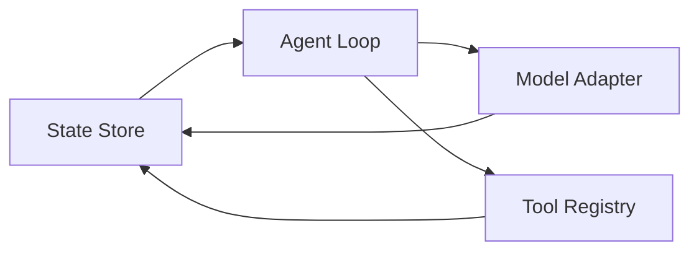

# 系统的架构

AgentGo 以 Agent Loop 为核心，将模型、工具、状态和运行环境组织成一个可观察的执行系统。

## 核心组件

### Agent Loop

Agent Loop 负责驱动一次次执行：读取当前状态，调用模型进行决策，执行工具或返回结果，然后将新的结果写回状态。

### Model Adapter

Model Adapter 为不同模型提供统一接口。上层运行时不需要绑定某一家模型服务，可以根据任务选择不同的模型能力。

### Tool Registry

Tool Registry 管理智能体可以使用的工具，包括工具的描述、参数校验、权限边界和执行结果。工具调用应当保持明确且可追踪。

### State Store

State Store 保存任务上下文、历史事件和运行状态。它让执行过程可以恢复，也让调试和评估拥有稳定的数据基础。

## 一次执行的生命周期

1. 运行时读取任务与当前状态。
2. 模型根据上下文选择下一步动作。
3. Tool Registry 校验并执行工具调用。
4. 执行结果写入 State Store。
5. Agent Loop 判断任务是否完成，或继续下一轮循环。

这种分层方式让模型策略与工程能力保持相对独立，同时为权限、观测、重试和评估提供了明确的扩展位置。

## 架构图源文件

[打开 Drawio 源文件](./_resources/test.drawio)

## 组件关系

