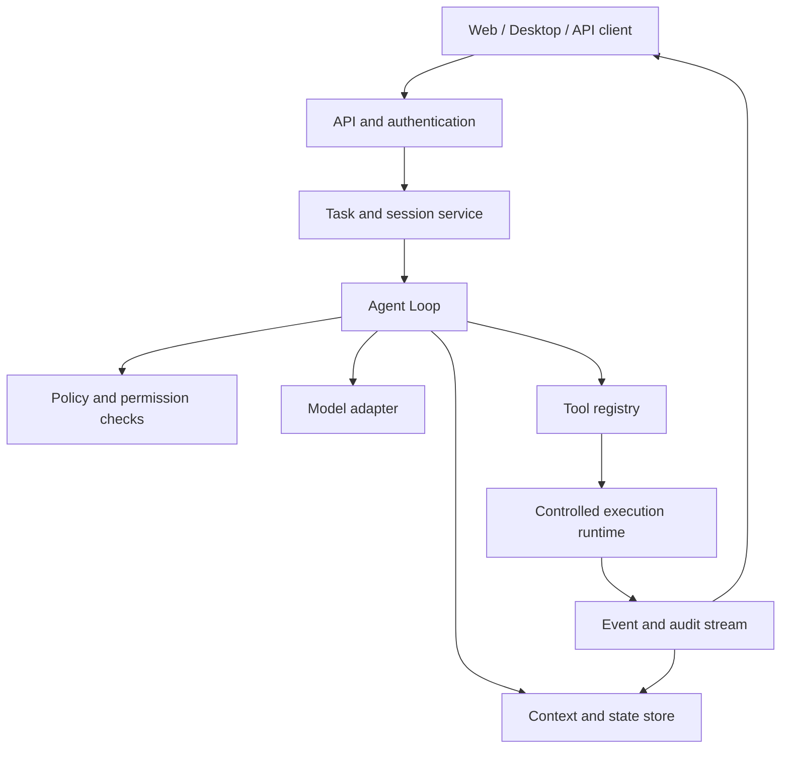

# AgentGo System Design

AgentGo is a runtime platform for building agents that can work through a task over multiple steps. The platform separates model reasoning from execution, state, policy, and presentation so that an agent can be inspected, resumed, and extended without rewriting the whole application.

## Design goals

- **Understandable:** every meaningful step is represented by an event and can be explained after the run.
- **Controllable:** tools, credentials, resources, and high-risk operations are checked at explicit boundaries.
- **Resumable:** a failed tool call or interrupted process does not discard the task state.
- **Extensible:** models, tools, storage, policies, and clients can evolve behind stable contracts.
- **Observable:** task progress, latency, failures, costs, and audit events can be correlated by task and execution IDs.

## Runtime architecture

The API layer owns identity, organization boundaries, task submission, and streaming results. The Agent Loop owns orchestration. Adapters isolate external providers, while the state and event layers make execution durable and observable.

## Execution lifecycle

1. A client submits a task with its goal, constraints, and execution context.
2. The task service authenticates the caller, creates an execution, and records the initial event.
3. The Agent Loop loads the current state and builds a bounded model context.
4. The model returns either a final response or a typed action request.
5. Policy checks validate the requested action before the tool registry dispatches it.
6. The runtime records the result, usage, error, and timing as an event.
7. The loop persists the new state and continues until completion, cancellation, timeout, or a policy decision requiring human input.

Every step must be idempotent or carry an execution key so retries do not silently duplicate side effects.

## Stable boundaries

| Boundary            | Responsibility                          | Contract to keep stable                                    |
| ------------------- | --------------------------------------- | ---------------------------------------------------------- |
| Client to API       | Submit tasks and consume progress       | Authentication, task, event, and error schemas             |
| Loop to model       | Request reasoning or structured actions | Model request, response, streaming, and usage shape        |
| Loop to tool        | Request a capability                    | Tool name, typed input, authorization, and result envelope |
| Runtime to resource | Perform side effects                    | Resource limits, timeout, cancellation, and audit metadata |
| Services to storage | Persist durable state                   | Task, execution, event, and version semantics              |

## Failure and recovery

Failures are data, not invisible control flow. Transient provider and network failures may be retried with bounded backoff. Invalid arguments, denied permissions, and exceeded budgets should stop the current action with a typed error. A task can then be resumed from its last durable checkpoint, cancelled, or handed to an operator.

Recovery must preserve the event history and clearly distinguish a retry from a new execution. Destructive actions require an explicit policy decision and, where configured, user confirmation.

## Extension model

New models implement the model adapter contract; new capabilities implement the tool contract; new persistence or queue backends implement infrastructure ports. Extensions declare their input schema, required permissions, limits, failure behavior, and observability fields. The core runtime should not depend on a provider-specific SDK or business-specific tool implementation.

## Operational checklist

- Correlate logs and events with organization, task, and execution identifiers.
- Apply least privilege to every tool and keep secrets outside prompts and source control.
- Bound context size, tool duration, retries, concurrency, and spend.
- Store enough state to resume safely, but redact sensitive values from events.
- Test successful, denied, timed-out, retried, cancelled, and resumed executions.
