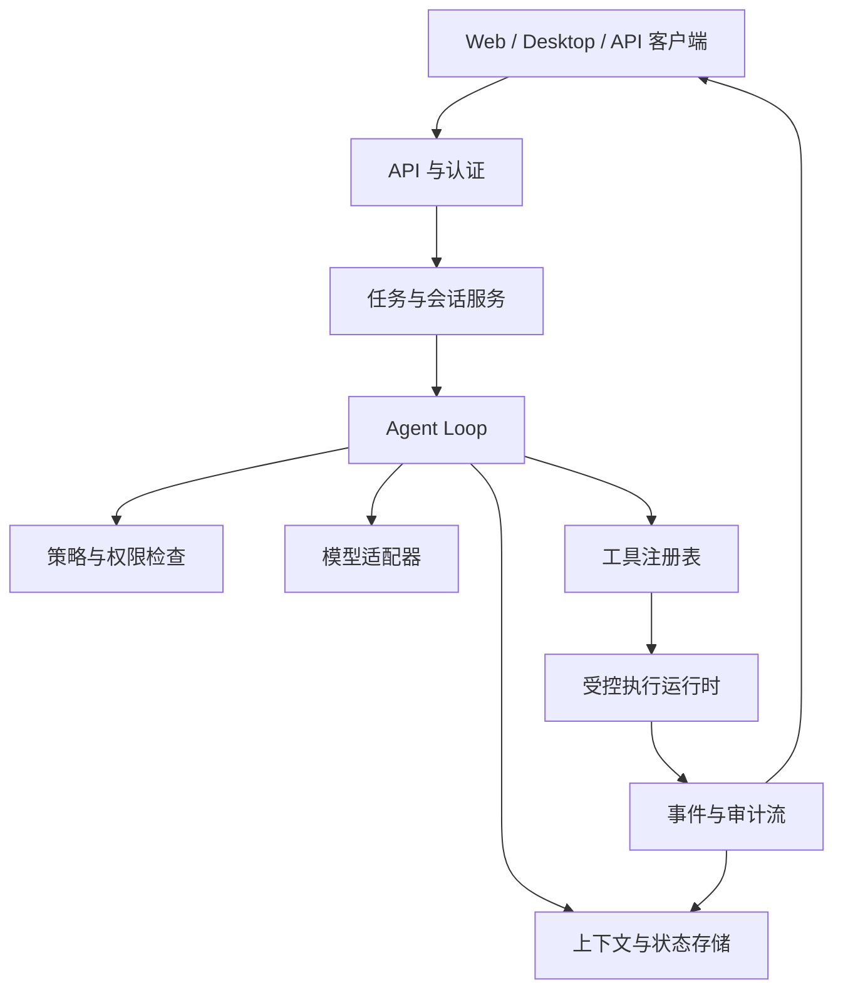

# AgentGo 系统设计

AgentGo 是一个用于构建多步骤智能体应用的运行时平台。系统将模型推理与执行、状态、策略和展示分离，使一次执行可以被检查、恢复和扩展，而不必重写整个应用。

## 设计目标

- **可理解：** 每个重要步骤都记录为事件，执行结束后可以解释和复盘。
- **可控制：** 工具、凭据、资源和高风险操作都在明确的边界上接受检查。
- **可恢复：** 工具调用失败或进程中断时，不丢失任务状态。
- **可扩展：** 模型、工具、存储、策略和客户端都可以在稳定契约后演进。
- **可观测：** 任务进度、延迟、失败、成本和审计事件可以通过任务与执行 ID 关联。

## 运行时架构

API 层负责身份、组织边界、任务提交和流式结果；Agent Loop 负责编排；适配器隔离外部服务；状态与事件层保证执行持久化并且可观测。

## 执行生命周期

1. 客户端提交任务目标、约束和执行上下文。
2. 任务服务认证调用方，创建执行记录并写入初始事件。
3. Agent Loop 读取当前状态，构建有边界的模型上下文。
4. 模型返回最终答复，或返回结构化动作请求。
5. 策略层在工具注册表分发前校验动作。
6. 运行时将结果、用量、错误和耗时记录为事件。
7. 循环持久化新状态，并继续执行，直到完成、取消、超时或需要人工介入。

每一步都必须具备幂等语义，或携带执行键，避免重试造成重复副作用。

## 稳定边界

| 边界         | 职责                 | 需要保持稳定的契约                 |
| ------------ | -------------------- | ---------------------------------- |
| 客户端到 API | 提交任务并消费进度   | 认证、任务、事件和错误结构         |
| 循环到模型   | 请求推理或结构化动作 | 请求、响应、流式输出和用量结构     |
| 循环到工具   | 请求一项能力         | 工具名、类型化输入、授权和结果封装 |
| 运行时到资源 | 执行副作用           | 资源限制、超时、取消和审计信息     |
| 服务到存储   | 持久化状态           | 任务、执行、事件和版本语义         |

## 故障与恢复

故障是可处理的数据，而不是不可见的控制流。短暂的服务商或网络故障可以使用有上限的退避重试；参数错误、权限拒绝和预算超限应以类型化错误结束当前动作。任务可以从最近一次持久化检查点恢复、取消，或交给操作人员处理。

恢复必须保留事件历史，并明确区分重试和新执行。破坏性操作必须经过明确的策略决策，并可按配置要求用户确认。

## 扩展模型

新模型实现模型适配器契约；新能力实现工具契约；新的存储或队列后端实现基础设施端口。每个扩展都应声明输入结构、所需权限、资源限制、失败行为和可观测字段。核心运行时不应依赖某个服务商 SDK 或业务工具的具体实现。

## 运行检查清单

- 使用组织、任务和执行标识关联日志与事件。
- 对每个工具采用最小权限，禁止将密钥放入提示词或源代码。
- 限制上下文大小、工具时长、重试次数、并发量和费用。
- 保存足够状态以安全恢复，同时从事件中脱敏敏感值。
- 覆盖成功、拒绝、超时、重试、取消和恢复执行的测试场景。
